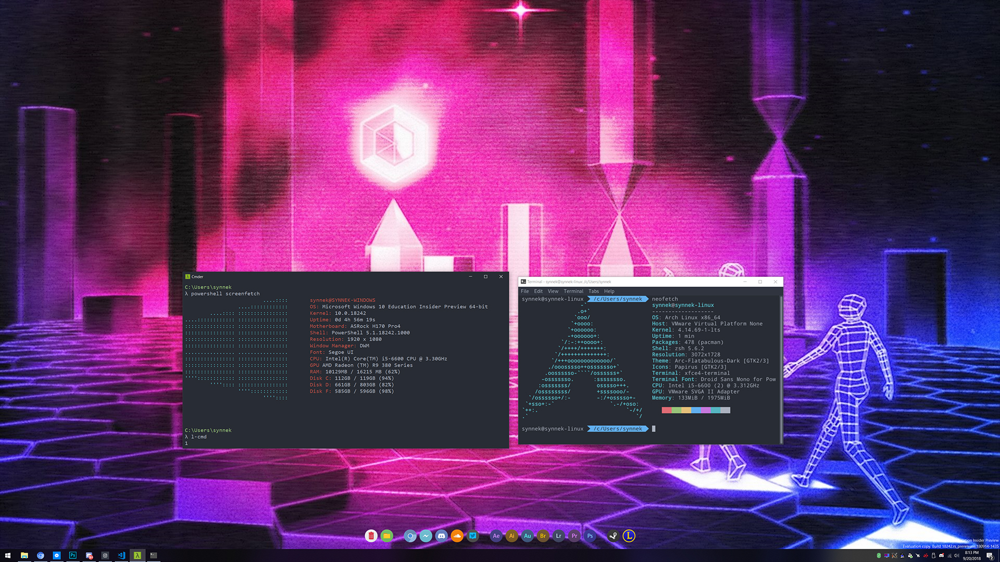

# iface

Rather bad Windows/Linux RPC interface specialized for a Windows-host/GNU+Linux-guest configuration.

**WARNING**: The Windows/GNU+Linux iface by is EXPERIMENTAL and has nothing to do with good coding, security, etc. **USE AT YOUR OWN RISK**.

In this guide, I'll show you how to setup Windows-host + GNU/Linux-guest using a VMWare Workstation.

# Setting up a Virtual Network Interfaces

* Open VMWare Workstation
* Go to: Edit -> Virtual Network Editor
* Create one Bridged Network Interface and attach your physical Network Adapter to it (it will be used to get the internet access on your linux guest)
* Create another Host-Only Adapter and configure DHCP as you like to


# Virtual Machine Creation
Create a Virtual Machine as you always do, but attach two of those Network Interfaces to it and install your favourite GNU/Linux Distribution (Btw. I use Arch). 

# VMWare Tools installation
* Arch Linux: ```sudo pacman -S open-vm-tools xf86-video-vmware```
* Debian/Ubuntu-based: ```sudo apt install open-vm-tools xserver-xorg-video-vmware```
* openSUSE: [software.opensuse.org](https://software.opensuse.org/download.html?project=Virtualization%3AVMware&package=open-vm-tools)

# Attaching host physical drivers to Virtual Machine
Make sure your on 4.x kernel or newer: ```uname -r```\
In VMWare Workstation go to: **Edit this Virutal Machine settings** -> **Options** -> **Shared Folders** -> Check **Always enabled** -> **Add** -> Add the root folder of every partition you want to attach and name it **DRIVE_C**, **DRIVE_D** etc.


# Credits
* [@gynvael](https://github.com/gynvael) for providing RPC Interface
* [@vmware](https://github.com/vmware) for providing virtualization solutions
* [@python](https://github.com/python) for providing Python Programming language