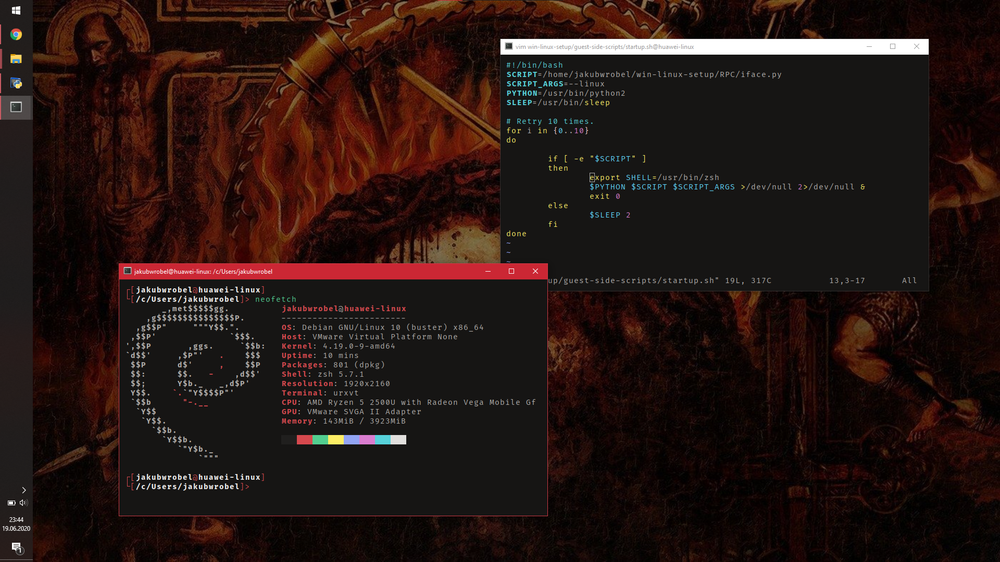
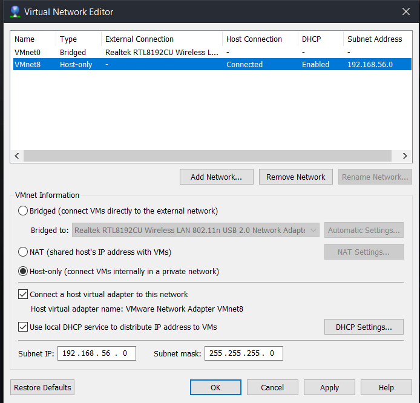
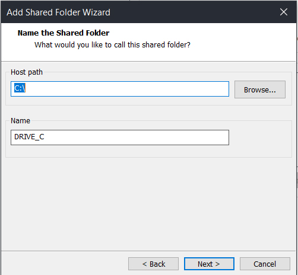
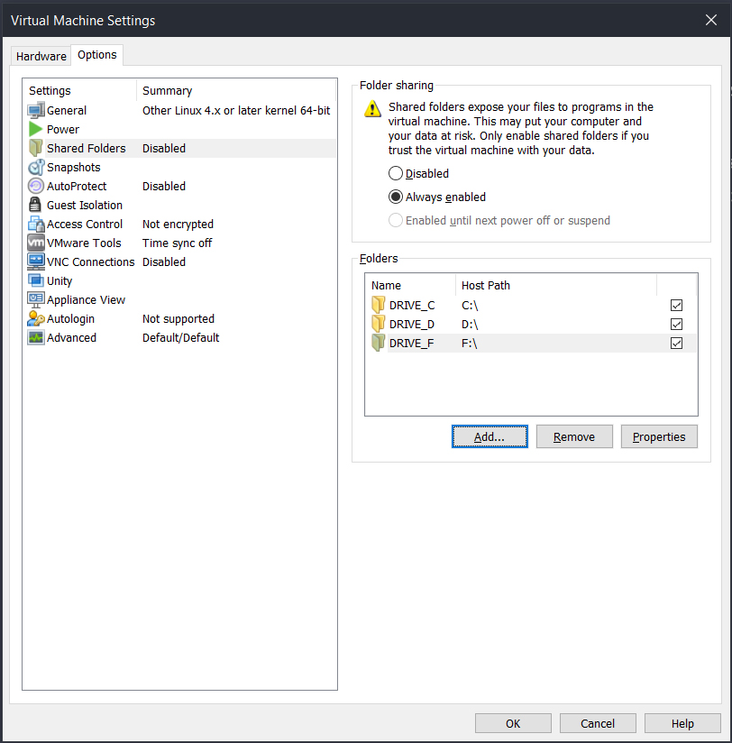
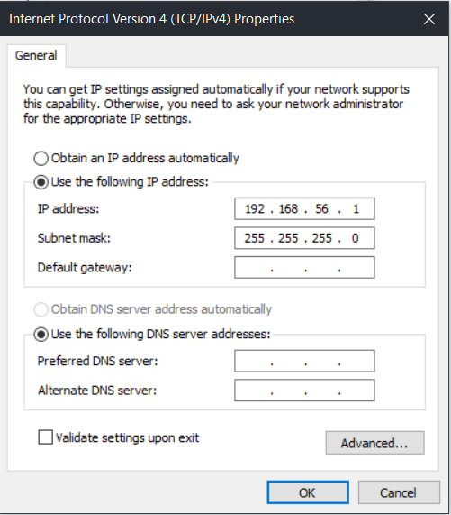

# iface

This is my implementation of [@gynvael](https://github.com/gynvael)'s Windows - host + Debian - guest setup using a VMWare Workstation 15. I faced some issues while following [@SynneK1337](https://github.com/SynneK1337)'s guide, so I decided to create a new and complete guide. I hope that somebody will find it useful.

**WARNING**: The Windows/GNU+Linux iface by is EXPERIMENTAL and has nothing to do with good coding, security, etc. **USE AT YOUR OWN RISK**.

# Setting up a Virtual Network Interfaces

* Open VMWare Workstation
* Go to: Edit -> Virtual Network Editor
* Create one Bridged Network Interface and attach your physical Network Adapter to it (it will be used to get the internet access on your linux guest)
* Create another Host-Only Adapter and set it up like on  the picture below



# Virtual Machine Creation
Create a Virtual Machine as you always do, but attach two of those Network Interfaces to it and install your favourite GNU/Linux Distribution.


# VMWare Tools installation
* Arch based: ```sudo pacman -S open-vm-tools xf86-video-vmware```
* Debian based: ```sudo apt install open-vm-tools xserver-xorg-video-vmware```

# Clone this repo to your VM and your Windows host
```
git clone https://github.com/jakubwrobel/win-linux-setup.git
```
# Attaching host physical drivers to Virtual Machine
Make sure your on 4.x kernel or newer: ```uname -r```\
```sudo poweroff``` \
In VMWare Workstation go to: **Edit this Virutal Machine settings** -> **Options** -> **Shared Folders** -> Check **Always enabled** -> **Add** \
Add the root folder of every partition you want to attach and name it **DRIVE_C**, **DRIVE_D** etc




In ```/etc/fstab``` add line/lines ```.host:DRIVE_x /mnt/x fuse.vmhgfs-fuse rw,allow_other 0 0``` where ```x``` is the letter of your Windows drive/drives.

# Set up Network Interfaces on your Guest
* Install NetworkManger
  * Arch based: ```sudo pacman -S networkmanager```
  * Debian based: ```sudo apt install network-manager```

* Enable NetworkManger service ```sudo systemctl enable NetworkManger```, disable other networking services e.g. ```dhcpcd.service```, ```networking.service``` and remove all interfaces starting with ``ens`` from ```/etc/network/interfaces``` file.
* ```sudo reboot```
* Set up your host-only interface ipv4 address to 192.168.56.3/24 using ```nmtui```.

# Set up Network Interface on your Host
**Control Panel** -> **Network and Sharing Center** -> **Change adapter settings** -> right-click on ***your host-only interface*** -> **Properties** -> **Internet Protocol Version 4 (TCP/IPv4)** \
set it up like on picture below



# Set Up SSH Server on guest-side **(for easier troubleshooting)**
* Install OpenSSH and enable it ```sudo systemctl enable ssh```
* edit ```/etc/ssh/sshd_config``` \
in line ***13***  change ```port``` to something different that 22 *(eg. 2137)* \
in line ***56*** change ```PasswordAuthentication``` to **no** \
in line ***32*** change ```PermitRootLogin``` to **no**

# Set Up SSH on Host-side
* Open ```cmd.exe```
* Generate SSH key with ```ssh-keygen```
* ```mkdir .ssh``` in your *$HOME* directory
* Transfer ```id_rsa.pub``` to guest using ```cp /c/Users/<your_windows_username>/.ssh/id_rsa.pub ~/.ssh/authorized_keys```
* Now you can connect to your VM by typing ```ssh -p <your_port> <your_linux_username>@192.168.56.3```

# Install VcXsrv
* [Download](https://sourceforge.net/projects/vcxsrv/)

# Configure all host-side scripts
* go to ```<REPO>/host-side-scripts``` \
Correct variables values on top of every file located in that directory. \
```linuxusername``` your linux username \
```windows_repopath``` path to this repo cloned into your Windows drive \
```linux_repopath``` path to this repo cloned into your Linux disk \
```pythonpath``` path to *python.exe*, it should be ```c:\python27\python.exe``` \
```pythonwpath``` path to *pythonw.exe*, it should be ```c:\python27\pythonw.exe``` \
```vmpath``` path to *.vmx* file located in your VM's directory

# Configure iface
* Edit ```<REPO>/RPC/iface.cfg``` \
in line ***2*** enter random string \
in line ***3*** enter path to *home* directory on guest-side \
in line ***6*** enter path to your *terminal emulator* \
Use same iface.cfg both on guest and host side.

# Add iface to autostart on guest-side
* Edit ```<REPO>/guest-side-scripts/startup.sh``` \
in line ***2*** enter path to the *iface.py* on guest-side \
in line ***4*** enter path to *python2* ```whereis python2``` \
in line ***13*** enter path to the shell you use ```whereis bash```/```whereis zsh```
* Install ```cron/cronie``` and enable it ```sudo systemctl enable cron/cronie```
* ```crontab -e``` \
add line
```@reboot *PATH to startup.sh*```

# Add iface to autostart on host-side
* Go to ```shell:startup``` using ```win+R``` shortcut and copy there ```<REPO>\host-side-scripts\config.xlaunch```
* Edit ```<REPO>\host-side-scripts\at-logon.xml``` \
in line ***6*** enter *your windows machine name* \ *your windows user name* \
in line ***33*** and ***34*** correct a path to the repo on the host side
* Edit ```<REPO>\host-side-scripts\after-waking-up.xml``` \
in line ***32*** and ***33*** correct a path to the repo on the host side
* Import ```<REPO>\host-side-scripts\at-logon.xml``` and ```REPO\host-side-scripts\after-waking-up.xml```


# Set up terminal
* If you want to use .Xresouces configured terminal place the config in the ```.Xdefaults```. You can use my urxvt config as an example.
```
! urxvt
URxvt*termName : rxvt-unicode-256color
URxvt.scrollBar: off
URxvt.font: xft:Fira Code:size=11
URxvt.boldFont: xft:Fira Code:style=Bold:pixelsize:11
URxvt*cursorBlink: true
URxvt*internalBorder: 11
URxvt*iconFile: /usr/share/icons/Adwaita/32x32/apps/utilities-terminal.png

! font
*.font: xft:Fira Code:size=9,xft:Twitter Color Emoji:size=9
Xft.antialias: true
Xft.hinting: true
Xft.rgba: false
Xft.autohint: false
Xft.hintstyle: hintfull
Xft.lcdfilter: lcddefault

! Clickable URLs
URxvt.perl-ext-common: default,matcher
URxvt.url-launcher: /usr/bin/xdg-open
URxvt.matcher.button: 1
```
* **Enable opening links in host's web browser** \
In ```/usr/share/applications/defaults.list``` look for x-scheme-handler and add ifaceurl.desktop in front of it, like this:
```
x-scheme-handler/http=ifaceurl.desktop;firefox.desktop;google-chrome.desktop
x-scheme-handler/https=ifaceurl.desktop;firefox.desktop;google-chrome.desktop
```
In the same directory, create an ifaceurl.desktop file:
```
[Desktop Entry]
Version=1.0
Name=iface URL handler
GenericName=iface URL handler
Comment=Send the URL to Windows side of the interface to open it.
Exec=<REPO>/RPC/if-openurl.py %U
Terminal=false
Type=Application
Categories=Network;WebBrowser;
MimeType=x-scheme-handler/http;x-scheme-handler/https
```
Run ```sudo update-desktop-database```
You might have to remove the same x-scheme-handlers in your ```~/.local/share/applications/mimeapps.list```

* **Create a shortcut to the terminal from *menu start*** \
Create a shortcut in ```C:\ProgramData\Microsoft\Windows\Start Menu\Programs``` with a target of ```<path_to_pythonw> (C:\Python27\pythonw.exe) <path_to_if-l-cmd.py> (c:\etc\win-linux-setup\RPC\if-l-cmd.py) <place_where_you_want_to_start_terminal> (/home/your_linux_username)```.

* **Set up 'open folder in terminal' in the context menu** \
Open ```regedit.exe``` \
Go to ```Computer\HKEY_CLASSES_ROOT\Unknown\shell``` and create there a new key with text you want to display in the context menu. \
In that key create a new key named ```Command``` and change its ```(Default)``` value to ```<path_to_pythonw> (C:\Python27\pythonw.exe) <path_to_if-l-cmd.py> (c:\etc\win-linux-setup\RPC\if-l-cmd.py) %cd%```.

# Set up SAMBA for guest -> host file sharing
* Install ```samba``` and enable it ```sudo systemctl enable samba```
* Edit ```REPO/guest-side-scripts/smb.conf``` \
In line ***36*** correct the name of the host-only adapter, ```ip a``` \
In line ***245*** and ***246*** add your Linux username
* ```sudo cp <REPO>/guest-side-scripts/smb.conf /etc/samba/smb.conf```
* ```sudo systemctl restart samba```
* Change samba password for your user ```smbpasswd <linux_username>```

# Credits
* [@gynvael](https://github.com/gynvael) for providing RPC Interface
* [@SynneK1337](https://github.com/SynneK1337) for writing great guide
